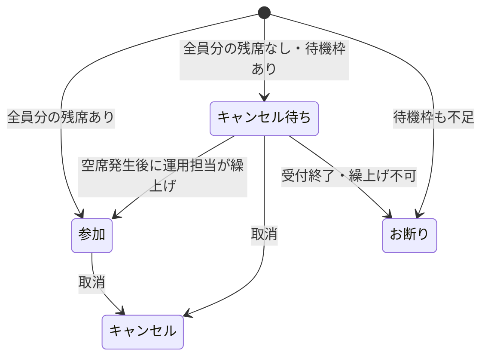

# 星空撮影イベント管理 拡張設計

## 1. 目的と段階導入

開催枠ごとの定員、キャンセル待ち、フォーム候補、通知、カレンダー、開催連絡を一つのデータモデルで管理する。既存のフォーム受付を止めないため、次の順で段階導入する。

1. 開催日管理・メールテンプレートの基盤を追加する。（実装済み）
2. Googleフォームへ `申し込み日時` 質問を追加し、既存フォーム回答・申込管理との対応列を追加する。（実装済み）
3. 集計とフォーム候補同期を導入する。（実装済み）
4. 申込時のステータス判定とメール分岐を同時に切り替える。（実装済み）
5. Discord、カレンダー、開催連絡を個別に有効化する。

申込ステータスだけを先行変更すると、現行 `onFormSubmit()` が設定する `新規受付` と不整合になる。このため第1段階では現行受付処理を維持し、新ステータス用定義だけを追加する。

## 2. シート構成と役割

| シート | 役割 | 更新主体 |
|---|---|---|
| フォームの回答 1 | Googleフォームの生回答。GASから編集しない | Googleフォーム |
| 申込管理 | 申込者、参加人数、開催枠、ステータス、通知結果 | GAS・運用担当 |
| 開催日管理 | 開催枠のマスタ、定員、集計、募集・実施状況 | 運用担当・GAS |
| 担当 | ガイド担当者名、メールアドレス、将来の出勤簿連携用情報 | 運用担当 |
| メールテンプレート | 件名・本文テンプレート | 運用担当 |
| 設定 | 非秘密の運用設定 | 運用担当 |
| ログ | 処理結果、エラー、通知履歴 | GAS |

秘密値はシートに保存しない。`DISCORD_WEBHOOK_URL`、`APPLICATION_FORM_ID`、`CALENDAR_ID` は Script Properties で管理する。

## 3. 開催日管理シート

| ヘッダー | 入力・自動 | 定義 |
|---|---|---|
| 申し込み日時 | 人間 | 開催日時。`Asia/Tokyo` |
| タイトル | 人間 | フォーム・通知・カレンダー表示名 |
| 定員 | 人間 | 新規申込を参加として受け付ける人数上限 |
| 最小催行人数 | 人間 | 最小催行到達通知の基準 |
| キャンセル待ち上限 | 人間 | 定員超過後に受け付ける人数上限 |
| 一人当たりの料金 | 人間 | 料金計算用 |
| 受付開始時間 | 人間 | 当日の受付開始時刻 |
| 開催メール | 自動 | `未送信` / `送信済み` / `送信エラー` |
| 募集状況 | 自動・手動 | `募集中` / `募集終了` / `キャンセル` |
| 実施状況 | 人間 | `雨天中止` / `人数不足で中止` / `開催決定` / `開催済み` |
| 最終参加人数 | 人間・将来自動 | 開催確定後の実績値 |
| ガイド謝金 | 人間 | 精算用 |
| 担当 | 人間 | 担当者 |
| 参加 | 自動 | 参加ステータスの参加人数合計 |
| キャンセル待ち | 自動 | キャンセル待ちの参加人数合計 |
| キャンセル | 自動 | キャンセルの参加人数合計 |
| お断り | 自動 | お断りの参加人数合計 |
| 申し込み人数 | 自動 | 受付履歴人数。4ステータスの人数合計 |
| Discord通知状況 | 将来自動 | 開催枠単位のDiscord通知状態 |
| カレンダー登録状況 | 将来自動 | 開催枠単位のカレンダー登録状態 |
| イベントID | 自動 | GoogleカレンダーのイベントID |
| 内部メモ | 人間 | 開催枠単位の運用メモ |
| 勤怠登録状況 | 保留 | 将来の出勤簿連携 |
| 勤怠登録キー | 保留 | 将来の出勤簿連携 |
| 参加者名簿URL | 自動 | 開催決定時に作成する参加者名簿PDFの共有URL |

`申し込み人数` は現在有効な参加希望数ではなく、キャンセル・お断りを含む累積受付人数とする。現在の需要は `参加 + キャンセル待ち`、残席は `定員 - 参加` で別に算出する。

申込管理には `お支払い` 列を持つ。新規申込時は `未払い` を初期値とし、運用担当が入金確認後に `お支払い済み` へ変更する。`お支払い済み` へ変更した時、インストール型編集トリガーが申込者へお支払い確認メールを送る。

開催枠単位の `Discord通知状況`、`カレンダー登録状況`、`イベントID` は開催日管理を正とする。申込管理ではこれらを管理せず、setupで同名列を削除する。申込管理の内部メモは申込単位、開催日管理の内部メモは開催枠単位で使い分ける。

`担当` は担当シートの `担当者名` と完全一致で照合する。単一担当は担当シートの名前をプルダウン選択できる。複数担当は `,`、`、`、改行、`/` で区切って手入力できるよう、開催日管理の `担当` 列の入力規則は警告のみとする。担当シートに見つからない名前やメールアドレス未設定の担当者はガイド向けメールから除外し、ログと確認ダイアログの警告に残す。参加者向けメールの対象判定には影響させない。

## 3.1 担当シート

担当シートはガイド担当者マスタで、`担当者名`, `メールアドレス`, `出勤簿キー`, `出勤簿登録対象`, `メモ` を持つ。

- `担当者名`: 開催日管理の `担当` と完全一致する照合キー。
- `メールアドレス`: ガイド向け実施状況メールの送信先。空欄の場合は送信しない。
- `出勤簿キー`: 将来の出勤簿連携用キー。今回のメール送信では使用しない。
- `出勤簿登録対象`: `対象` / `対象外` のプルダウン。今回のメール送信では必須条件にしない。
- `メモ`: 運用メモ。

setupはシートがなければ作成し、既存シートがあれば不足ヘッダーだけを末尾追加する。既存データは削除・上書きしない。

## 3.2 参加者名簿シート

`参加者名簿` はPDF出力用の雛形シートである。setupで作成し、タイトル、申し込み日時、実施状況、参加者の `お名前` と `参加人数` を入れるレイアウトを整える。開催決定の確定処理ではこの雛形へ参加者情報を書き込み、該当シートだけをPDF出力する。

PDFは設定 `PARTICIPANT_ROSTER_FOLDER_ID` のDriveフォルダに保存し、`リンクを知っている全員が閲覧可` に設定する。初期保存先は `18KDES6jvJMtUUccuS4cpISaZSMZ-5yZ3` である。作成したURLは開催日管理の `参加者名簿URL` に保存し、ガイド向け開催決定メールに記載する。既に `参加者名簿URL` がある場合は再生成せず、そのURLを再利用する。

## 4. 申込管理との関係

申込管理へ `申し込み日時`、`タイトル`、`開催枠キー` を末尾追加する。フォーム回答にはフォーム所有の `申し込み日時` と、GASが補完する `タイトル`、`開催枠キー` を持つ。既存回答列は移動・上書きしない。開催枠は、日時をJSTで正規化した値とタイトルから生成したキーで照合する。

開催枠キーはJSTの開催日時とタイトルのSHA-256ダイジェスト先頭24桁とする。日時・タイトル変更時はキーも変わるため、既存申込がある枠の変更前には申込側の移行が必要である。将来、完全に不変なランダムIDを開催日管理へ保存する方式への変更を推奨する。カレンダーの `イベントID` は登録前には存在しないため主キーには使わない。

開催日管理の集計は申込管理だけを正とする。フォーム回答シートを直接集計しない。

## 5. ステータス遷移

繰上げは自動化せず、最初は運用担当が対象申込を確認して手動変更する。複数人申込の分割は行わない。

## 6. フォーム候補日の更新ルール

`updateApplicationFormChoices()` は Script Properties の `APPLICATION_FORM_ID` でフォームを開き、タイトルが `申し込み日時` のリスト項目を一つだけ特定する。

- `募集状況 = 募集中` の行だけを対象とする。
- 開催日時昇順で並べる。
- 表示は通常 `yyyy/MM/dd HH:mm タイトル【残りN人】` とする。
- 残席 `N = max(定員 - 参加, 0)`。
- `N <= LOW_REMAINING_THRESHOLD` かつ `N > 0` の場合は人数を表示せず `【残りわずか】` とする。初期値は4。
- `参加 >= 定員` で `キャンセル待ち < キャンセル待ち上限` なら `【キャンセル待ち】` として表示する。許容超過人数を理由に `【残りわずか】` とは表示しない。
- `参加 + キャンセル待ち >= 定員 + キャンセル待ち上限` の枠は募集終了とし候補から外す。
- 同名質問が0件または複数件なら更新せずエラーにする。
- 候補が0件の場合はフォームを壊さないため、空配列更新はせず、運用担当へエラーを返す。

フォーム表示文言は可変なので主キーにしない。フォーム送信時は末尾の残席表示を除いた `日時 + タイトル` で開催枠を解決し、開催枠キーを申込管理へ保存する。旧形式の `【残りN人】`、`【残り0人・キャンセル待ち】` と、新形式の `【残りわずか】`、`【キャンセル待ち】` のすべてを除去できるため、古いブラウザの候補も解決できる。

## 7. 申込判定ルール

スクリプトロック内で、同じ開催枠の最新集計を取得して申込単位で判定する。

1. `現在参加 + 申込人数 <= 定員 + CAPACITY_OVERBOOK_ALLOWANCE` なら全員を `参加`。
2. 参加枠に全員入らず、`現在待機 + 申込人数 <= キャンセル待ち上限` なら全員を `キャンセル待ち`。
3. 待機枠にも全員入らない場合は `お断り`。
4. 一つの申込を参加と待機に分割しない。

例: 定員20、許容超過人数2、現在参加7、申込14名は合計21なので全員を参加とする。現在参加21、申込2名は合計23となり参加上限22を超えるため、待機枠に収まれば申込全体をキャンセル待ちにする。同行者を参加と待機へ分割しない。

`CAPACITY_OVERBOOK_ALLOWANCE` はシステム共通設定で、初期値は2。新規申込後の参加人数が `定員 + 許容人数` 以下なら参加として受け付ける。設定値が空、負数、小数、数値以外の場合はデフォルトへ戻さず処理をエラーにする。

## 8. 募集状況の自動更新

集計後に次を評価する。

- `参加 + キャンセル待ち >= 定員 + キャンセル待ち上限`: `募集終了`
- 上記未満: 原則 `募集中`

開催日時経過、運用判断、実施状況確定による強制終了も必要なため、将来は `自動募集状況` と `手動停止` を分離する列が望ましい。現行ヘッダーだけで実装する段階では、実施状況が入力済み、または開催日時を過ぎた枠は常に `募集終了` とし、GASが手動の `募集終了` を勝手に再開しないルールにする。

処理順は「申込管理集計 → 募集状況更新 → フォーム候補更新」とする。

## 9. メール送信とテンプレート

メールテンプレートシートは `キー / 値 / 説明` で管理する。件名と本文を別キーにし、初期値は setup で存在しないキーだけ追加する。既存編集値は上書きしない。

差し込み:

- `{{お名前}}`
- `{{申し込み日時}}`
- `{{タイトル}}`
- `{{参加人数}}`
- `{{一人当たりの料金}}`
- `{{合計料金}}`
- `{{受付開始時間}}`
- `{{ステータス}}`
- `{{主催者名}}`
- `{{返信先メール}}`
- `{{実施状況}}`
- `{{担当者名}}`
- `{{開催可否}}`
- `{{開催できない理由}}`
- `{{キャンセル待ち人数}}`
- `{{定員}}`
- `{{最小催行人数}}`
- `{{参加者名簿URL}}`

置換後に未解決の `{{...}}` が残れば送信せずエラーにする。HTMLとして送る場合は差し込み値をエスケープする。

申込時は `参加`、`キャンセル待ち`、`お断り` で分岐する。お断りには `application_declined_subject/body` を使用する。`キャンセル` はフォーム受付時には使用しない。旧ステータスの既存申込を再送する場合だけ、旧コード内テンプレートへフォールバックする。

実施状況メールは参加者向けとガイド向けでテンプレートを分離する。参加者向けは `event_confirmed_*`, `event_rain_cancel_*`, `event_insufficient_cancel_*`, `event_completed_*`、ガイド向けは `guide_event_confirmed_*`, `guide_event_rain_cancel_*`, `guide_event_insufficient_cancel_*`, `guide_event_completed_*` を使う。setupは存在しないキーだけを追加し、人間が編集した既存テンプレートを上書きしない。

参加受付メールでは、参加費がクレジットカードによる事前払い制であること、`PAYMENT_LINK`、および `一人当たりの料金 * 参加人数` の合計金額を案内する。既存テンプレートに支払いリンクが含まれない場合も、送信時に本文末尾へ支払い案内を追記する。お支払い確認メールは `payment_confirmed_subject/body` を使い、イベント名、申し込み日時、参加人数、一人当たりの料金、支払い金額、受付開始時間を記載する。

## 10. Discord通知

申込ごとのDiscord通知は停止する。

- 最小催行人数到達通知: 開催枠ごとに、直前集計が最小催行人数未満、最新集計が最小催行人数以上になった時に一度だけ送る。
- キャンセル待ち受付開始通知: 開催枠ごとに、フォーム候補が `【キャンセル待ち】` になる状態へ到達した時に一度だけ送る。具体的には、参加人数が定員以上で、募集状況が募集中かつキャンセル待ち枠に空きがある時とする。実際のキャンセル待ち人数が0人でも通知対象となる。

通知状態の正は開催日管理の `最小催行通知`、`キャンセル待ち通知`、`5日前通知` とする。各列は `未通知`、`通知済み`、`通知エラー` を持つ。申込管理には通知列を持たない。既存の `Discord通知状況` は最小催行・キャンセル待ち通知の総合表示として残す。

状態:

- `未通知`: どちらも未送信
- `最小催行人数到達通知済み`: 最小催行人数通知だけ送信済み
- `キャンセル待ち発生通知済み`: フォームのキャンセル待ち受付開始通知だけ送信済み
- `両方通知済み`: 両方送信済み
- `通知エラー`: 送信成功履歴がない状態でエラー。再実行時に条件を再判定する

一方の送信後に他方が失敗した場合は、成功済み側の状態を保持して未送信側だけを再試行する。`雨天中止`、`人数不足で中止`、`開催済み` の開催枠には送信しない。

開催5日前通知:

- JSTで開催日のちょうど5日前の日付に一度だけ送る。時刻は比較しない。
- タイトル、申し込み日時、募集状況、参加人数、キャンセル待ち人数、定員、最小催行人数を含める。
- 4日前以降や6日前以前は対象外とし、過去分の追送はしない。
- 手動メニューと、毎日9時台に実行される時間主導型トリガーから同じ関数を呼ぶ。
- `5日前通知 = 通知済み` なら再送しない。`通知エラー` は同じ対象日に再実行すれば再試行できる。
- DISCORD_WEBHOOK_URL未設定はsetupを止めず警告とし、通知実行時はエラーにする。

## 11. カレンダー登録

機能スイッチ `APP_CONFIG.FEATURES.CALENDAR_SYNC_ENABLED` で有効・無効を制御する。初期値は `false` とし、無効時はメニュー項目を表示せず、`registerEventSlotsToCalendar()` を直接実行しても登録・削除を行わない。

Script Properties の `CALENDAR_ID` を使用する。開催日時とタイトルがあり、イベントIDが空の開催枠だけを手動関数 `registerEventSlotsToCalendar()` で新規登録する。イベントIDの有無だけで重複を防ぎ、カレンダー内の同日時・同タイトル検索は行わない。

`カレンダー登録状況` と `イベントID` は開催日管理を正とする。申込管理にはどちらも持たない。

- タイトル: `タイトル`
- 開始: `申し込み日時`
- 終了: 開始日時の2時間後
- 説明: 設定しない。定員、参加人数、キャンセル待ち人数などを含めない
- 場所: 設定しない
- 作成成功後、イベントIDを書き込み、カレンダー登録状況を `登録済み` にする。
- 行単位の失敗時はカレンダー登録状況を `登録エラー` にしてログへ記録し、後続行を継続する。
- イベントIDがある行は再作成しない。
- 募集状況が `キャンセル` かつイベントIDがある行は、登録済みイベントを削除する。
- 削除後はイベントIDを空欄にし、カレンダー登録状況を `削除済み` にする。
- 募集状況が `キャンセル` の行は、イベントIDが空でも新規登録しない。
- カレンダー側ですでにイベントが見つからない場合も削除完了として扱い、シート側を `削除済み` に整える。

`CALENDAR_ID` 未設定はsetupを停止させず、`checkApplicationFormSetup()` の警告とする。登録実行時にはエラーとする。日時・タイトル変更時の更新、実施中止時の削除、カレンダー側で消されたイベントの復旧は保留する。

## 12. 実施状況変更時の一斉メール

開催日管理の `実施状況` を `開催決定`、`雨天中止`、`人数不足で中止`、`開催済み` のいずれかへ変更すると、インストール型 `onEdit` トリガーが確認ダイアログを表示する。`onEdit` 自体はメールを送らず、対象者名を確認して「はい」を押した後のサーバー処理だけが送信する。

- 参加者向け対象は同じ開催枠かつ申込ステータスが `参加` の申込だけ。
- メールアドレスが空の申込、キャンセル待ち、キャンセル、お断りは参加者向け対象外。
- ガイド向け対象は開催日管理の `担当` を分割し、担当シートの `担当者名` と完全一致した行の `メールアドレス` へ送る。同じメールアドレスは1回だけ送る。
- 実施状況に対応するテンプレートを選択する。
- ダイアログにはタイトル、日時、変更後の実施状況、参加者向け対象人数・対象者名、ガイド向け対象人数・対象者名を表示する。
- 担当者が担当シートに見つからない場合、またはメールアドレス未設定の場合はダイアログとログに警告を残す。
- `開催決定` の場合は、メール送信前に `参加者名簿` シートへ参加者名と人数を書き込み、PDFをDriveへ保存して共有URLを開催日管理へ記録する。
- 「はい」は参加者向けとガイド向けを送信し、両方が問題なく完了したら開催メールを `送信済み`、前回実施状況を現在値へ更新する。ガイド送信対象0人はログに残し、参加者向けが成功していれば成功扱いにする。
- 「いいえ」はどちらのメールも送らず、実施状況を `前回実施状況` へ戻し、開催メールを変更しない。
- 参加者向けの未解決差し込みや送信エラー時は全体を失敗にする。ガイド向けだけの未解決差し込みや送信エラー時も開催メールを `送信エラー` とし、どちらで失敗したかログに記録する。
- 排他ロックを取得する。
- `開催メール = 送信済み` の枠は原則再送せず、変更を戻して警告する。
- `前回実施状況` はsetupで末尾へ追加して非表示にし、取り消し時の復元に使う。
- `{{実施状況}}` を含む既存の差し込み項目を利用できる。

## 13. 第2段階までに実装した範囲

- 本設計資料。
- `開催日管理` シートの作成、指定ヘッダー、固定行、列幅、日時・金額書式、フィルタ。
- 募集状況、実施状況、開催メールのプルダウン。
- `メールテンプレート` シートの作成、固定行、列幅、フィルタ。
- 指定されたテンプレートキーと初期テンプレートの投入。
- configへのシート名、ヘッダー、選択肢、フォーム項目名、テンプレートキーの集約。
- setup点検対象への新シート追加。
- フォーム回答と申込管理への開催枠関連列の安全な末尾追加。
- 開催枠キー生成と新規回答への保存。
- 申込単位の参加・キャンセル待ち・お断り判定。
- 開催日管理のステータス別人数集計と募集終了判定。
- メールテンプレート読込、差し込み検証、申込ステータス別送信。
- お断りメールテンプレート。
- `updateApplicationFormChoices()`。
- `APPLICATION_FORM_ID` の必須検証。
- 開催日管理へのDiscord通知状況、カレンダー登録状況、内部メモの追加。
- 開催日管理への最小催行通知、キャンセル待ち通知、5日前通知の追加。
- `CAPACITY_OVERBOOK_ALLOWANCE` と `LOW_REMAINING_THRESHOLD` の設定・検証。
- 申込管理のDiscord通知状況・カレンダー登録状況・イベントIDを安全に削除するsetup移行。
- 定員基準の参加判定と `【残りわずか】` 表示。

## 14. 第2段階後も保留する範囲

- Discord通知状態を通知種別ごとに別列へ分割する将来拡張。
- 日次トリガー。
- 既存カレンダーイベントの更新・削除・検索同期。
- 実施状況メールの個別再送・送信履歴詳細管理。
- 既存申込への開催枠キーの一括バックフィル。
- Discord通知状況を通知種別ごとに管理する詳細方式、開催メール対象状況・日時。
- 勤怠登録状況・勤怠登録キーを利用する処理。

## 15. 動作確認手順

今回は外部サービスを呼ばず、テスト用スプレッドシートで次を確認する。

1. `setupApplicationFormSheet()` を実行する。
2. 開催日管理、担当、参加者名簿、メールテンプレートが作成される。
3. 開催日管理に定義済みヘッダーが存在する。既存列は移動せず、不足列が末尾へ安全に追加される。
4. 募集状況、実施状況、開催メールに指定プルダウンがある。
5. 1行目が固定され、列幅、日時、時刻、金額書式、フィルタが設定される。
6. メールテンプレートに参加者向け・ガイド向けの定義済みキーが一度ずつ存在する。
7. テンプレート値を編集して再度setupを実行し、編集値が上書きされない。
8. 申込管理からDiscord通知状況、カレンダー登録状況、イベントIDだけが削除され、他の列・データが保持される。
9. `checkApplicationFormSetup()` が担当シートと参加者名簿シートも点検する。
10. Googleフォームに `申し込み日時` プルダウンを作り、Script Propertiesへ `APPLICATION_FORM_ID` を設定する。
11. `updateApplicationFormChoices()` で募集中枠だけが残席付きで反映される。
12. 定員＋許容人数以内、許容人数超過、待機上限超過の申込がそれぞれ参加、キャンセル待ち、お断りになる。
13. 集計列、募集状況、メール本文の差し込み、申込管理と回答シートの開催枠キーを確認する。
14. 残席5では `【残り5人】`、定員未満で残席4以下なら `【残りわずか】`、定員到達後に待機可能なら `【キャンセル待ち】` になる。
15. CALENDAR_ID未設定ではsetupが成功し、点検結果だけが警告になる。
16. カレンダー登録候補が、キャンセル以外かつイベントID空・日時あり・タイトルありの行だけになる。
17. 募集状況がキャンセルでイベントIDがある行だけが削除対象となり、削除後はイベントID空欄・登録状況 `削除済み` になる。
18. 開催日がJSTの今日から5日後かつ5日前通知が未通知の場合だけ対象となる。
19. setupを複数回実行しても5日前通知の日次トリガーが1件だけ存在する。

## 16. 運用設定

| キー | 初期値 | 用途 |
|---|---:|---|
| CAPACITY_OVERBOOK_ALLOWANCE | 2 | 新規申込を参加扱いにできる定員超過の許容人数 |
| LOW_REMAINING_THRESHOLD | 4 | フォーム候補を `【残りわずか】` に切り替える残席数 |

setupは不足キーだけを追加し、既存値を上書きしない。両方とも0以上の整数のみ有効とする。
